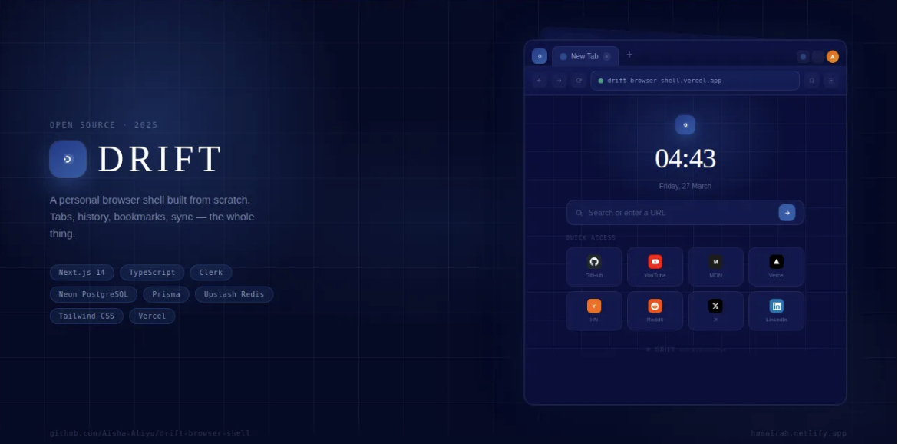

# DRIFT

A browser shell built with Next.js. Not a wrapper around an existing browser — an actual browser interface written from scratch, with tabs, history, bookmarks, incognito mode, keyboard shortcuts, and cross-device sync.

Live: [drift-browser-shell.vercel.app](https://drift-browser-shell.vercel.app)

---

## What it is

DRIFT is a fully functional browser shell that runs in the browser. You can open multiple tabs, navigate to real websites, bookmark pages, search your history, and have everything sync to a database when you are signed in. It handles the full browser experience: tab management, address bar with smart URL resolution, security indicators, navigation controls, and a new tab page with a live clock and quick access links.

The project started as a portfolio piece but ended up being something I actually use. Building something this close to a real browser forces you to understand the web platform at a different level than most projects.

---

## Stack

| Layer | Technology |
|---|---|
| Framework | Next.js 14 (App Router) |
| Language | TypeScript — strict mode throughout |
| Auth | Clerk |
| Database | Neon PostgreSQL (serverless) |
| ORM | Prisma |
| Rate limiting | Upstash Redis |
| Styling | Tailwind CSS + inline styles |
| Deployment | Vercel |

---

## Features

**Browser core**
- Multi-tab browsing — open, close, switch, duplicate tabs
- Address bar with smart resolution — detects domains, handles search queries, validates URLs
- HTTPS security badge per tab — click it to copy the current URL
- Incognito mode — tabs that leave no history
- Back, forward, reload, stop, home navigation
- Loading skeleton while pages render
- Error page with retry for blocked or unreachable sites

**New tab page**
- Live clock with hours, minutes, and seconds
- Search bar defaulting to DuckDuckGo
- Eight quick-access site tiles with hover lift effect
- Recent history list with visit timestamps

**Bookmarks and history**
- Star any page from the address bar
- Bookmark bar below the address bar
- Sidebar panel for history and bookmarks
- Empty states with descriptive illustrations
- Everything persists to PostgreSQL when signed in

**Auth and sync**
- Sign in with email or Google via Clerk
- Bookmarks and history sync to Neon PostgreSQL on every action
- Data loads from the database automatically on sign-in
- Works completely without an account — auth only adds persistence

**Settings**
- Search engine picker — DuckDuckGo, Google, Bing
- Bookmark bar toggle
- Font size selector
- Clear history and downloads
- Keyboard shortcut reference

**Find in page**
- Ctrl+F opens a find overlay inside the active tab
- Next and previous result navigation
- Degrades gracefully on cross-origin sites with a clear notice

**Tab context menu**
- Right-click any tab to duplicate it, reopen as incognito, reload, close, or close all others

**Keyboard shortcuts**

| Shortcut | Action |
|---|---|
| Ctrl + T | New tab |
| Ctrl + W | Close tab |
| Ctrl + L | Focus address bar |
| Ctrl + R | Reload |
| Ctrl + Shift + N | Incognito tab |
| Ctrl + F | Find in page |
| Alt + ← | Go back |
| Alt + → | Go forward |
| Ctrl + 1–9 | Switch to tab by index |

**Mobile**
- Edge swipe left to go back, right to go forward
- Fully responsive down to 320px
- PWA manifest — add to home screen on iOS and Android

**Toast notifications**
- Feedback for bookmark saved, removed, URL copied, history cleared

---

## Getting started

```bash
git clone https://github.com/Aisha-Aliyu/drift-browser-shell
cd drift-browser-shell
npm install
cp .env.example .env.local
```

Fill in your environment variables, then:

```bash
npx prisma db push
npm run dev
```

---

## Environment variables

| Variable | Where to get it |
|---|---|
| `DATABASE_URL` | [neon.tech](https://neon.tech) — copy the pooled connection string |
| `UPSTASH_REDIS_REST_URL` | [console.upstash.com](https://console.upstash.com) |
| `UPSTASH_REDIS_REST_TOKEN` | Same Upstash dashboard |
| `NEXT_PUBLIC_CLERK_PUBLISHABLE_KEY` | [dashboard.clerk.com](https://dashboard.clerk.com) |
| `CLERK_SECRET_KEY` | Same Clerk dashboard |

---

## Project structure

```
src/
  app/
    api/
      bookmarks/        GET · POST · DELETE
      history/          GET · POST · DELETE
    sign-in/
    sign-up/
  components/
    browser/
      BrowserShell      Root layout, keyboard shortcuts, swipe gestures
      TabStrip          Tab row with user avatar
      Tab               Individual tab with context menu
      AddressBar        URL input, nav controls, security badge, settings
      BrowserViewport   iframe renderer with loading skeleton
      NewTabPage        Clock, search, quick links, recent history
      Sidebar           History and bookmarks panel
      FindBar           Ctrl+F search overlay
      SettingsPanel     Preferences dropdown
      DownloadTray      Download status strip
      ErrorPage         Blocked or unreachable site fallback
    ui/
      Toast             Notification system
  context/
    BrowserContext      Global state via useReducer
  hooks/
    useKeyboardShortcuts
    useSwipeGesture
    useSyncData
  lib/
    url                 URL parsing, sanitization, search engine resolution
    prisma              DB client singleton
    ratelimit           Upstash sliding window rate limiter
  types/
    browser             All TypeScript interfaces and action types
```

---

## Security

- All API routes are authenticated via Clerk before any database operation
- Every database query goes through Prisma — no raw SQL anywhere in the codebase
- All URL inputs are sanitized before navigation or storage — blocks `javascript:`, `data:`, and `vbscript:` schemes
- Rate limiting on every API route — 100 requests per hour per IP via Upstash sliding window
- Per-user data scoping — every query includes `userId` so users cannot read or delete each other's data
- Security response headers on all routes — `X-Content-Type-Options`, `X-Frame-Options`, `X-XSS-Protection`, `Referrer-Policy`
- `poweredByHeader: false` in Next.js config removes the `X-Powered-By` response header

---

## Known limitations

Cross-origin iframes cannot be scripted by the parent frame. This is a browser security policy, not a limitation of this codebase. Find-in-page works on same-origin content and shows an informative notice on cross-origin sites. Back and forward navigation uses `contentWindow.history` with a try/catch for the same reason. Many sites also block iframe embedding via `X-Frame-Options` headers — these show the error page with a retry button.

---

## Author

Aisha Aliyu, software engineer and full-stack developer open to remote roles across the US, UK, and EU.

[humairah.netlify.app](https://humairah.netlify.app) · [GitHub](https://github.com/Aisha-Aliyu) · [LinkedIn](https://linkedin.com/in/aisha-aliyu)
